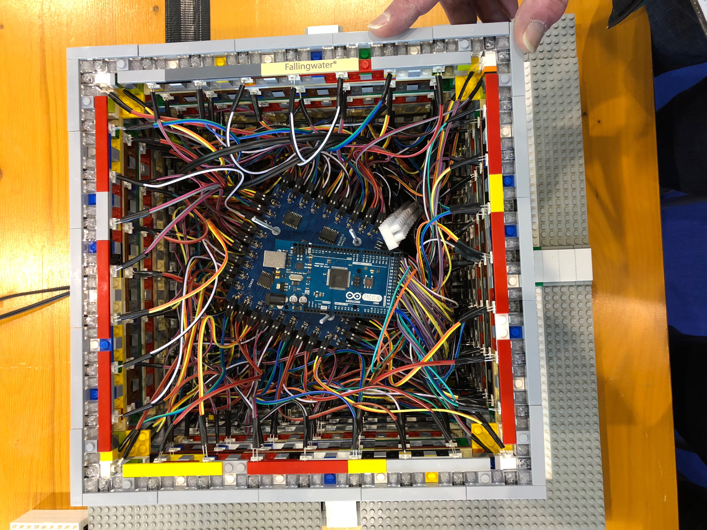
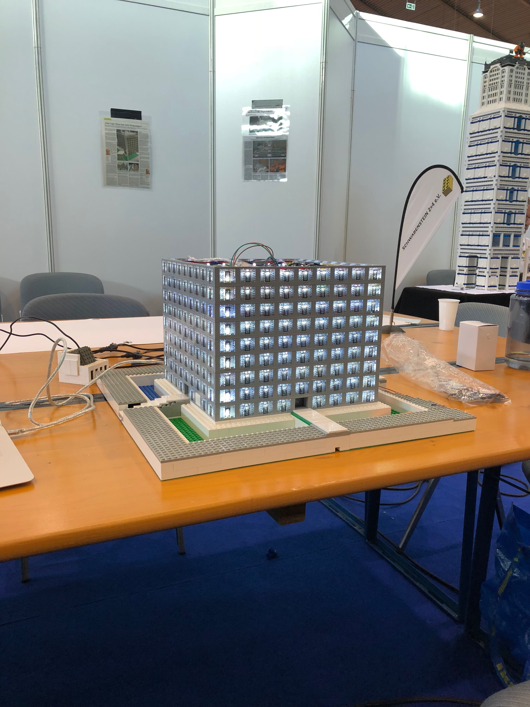

# Beleuchtung der LEGO Stadtbibliothek Stuttgart

## Platine
KiCad Projekt:
[beleuchtung_stadtbibliothek.pro](./kicad/beleuchtung_stadtbibliothek.pro)

Pin-Belegung `CON1`:

 * 1 => `VCC`
 * 2 => `GND`
 * 3 => `CLK`
 * 4 => Clear für für Schieberegister
 * 5 => Data-Input für Schieberegister 
 * 6 => Enable für LED-Treiber 

### Schaltplan
[beleuchtung_stadtbibliothek.sch](./kicad/beleuchtung_stadtbibliothek.sch)

### Layout/PCB
[beleuchtung_stadtbibliothek.kicad_pcb](./kicad/beleuchtung_stadtbibliothek.kicad_pcb)
    

### Gerber Dateien für Seeedstudio
[kicad/gerber](./kicad/gerber)

### Bauelemente (für 10 Platinen)
Reichelt:

 * 10x [Stiftleisten 2,54 mm, 2X03, gewinkelt](https://www.reichelt.de/Stiftleisten/MPE-088-2-006/3/index.html?ACTION=3&LA=2&ARTICLE=119904&GROUPID=7434&artnr=MPE+088-2-006&SEARCH=%252A)
 * 15x [50pol. Stiftleiste, gewinkelt, RM 2,54](https://www.reichelt.de/Stiftleisten/SL-1X50W-2-54/3/index.html?ACTION=3&LA=2&ARTICLE=19509&GROUPID=7434&artnr=SL+1X50W+2%2C54&SEARCH=%252A)
 * 50x [SMD HC 164](https://www.reichelt.de/ICs-74HC-SMD/SMD-HC-164/3/index.html?ACTION=3&LA=2&ARTICLE=18650&GROUPID=2931&artnr=SMD+HC+164&SEARCH=%252A)
 * 50x [SMD HC 244](https://www.reichelt.de/ICs-74HC-SMD/SMD-HC-244/3/index.html?ACTION=3&LA=2&ARTICLE=18663&GROUPID=2931&artnr=SMD+HC+244&SEARCH=%252A)
 * 2x [CR 44](https://www.reichelt.de/Flussmittel-Loetpasten/CR-44/3/index.html?ACTION=3&LA=2&ARTICLE=6833&GROUPID=4132&artnr=CR+44&SEARCH=%252A)
 * (3-5)x [GS25E05-P1J](https://www.reichelt.de/Festspannungsnetzteile/GS25E05-P1J/3/index.html?ACTION=3&LA=2&ARTICLE=161618&GROUPID=4946&artnr=GS25E05-P1J&SEARCH=%252A)
 * (3-5)x [DELOCK 65524](https://www.reichelt.de/Hohlstecker/DELOCK-65524/3/index.html?ACTION=3&LA=2&ARTICLE=143219&GROUPID=7488&artnr=DELOCK+65524&SEARCH=%252A)
 * 1x [EL 6-FACH MS-LG](https://www.reichelt.de/Steckdosenleiste-allgemein/EL-6-FACH-MS-LG/3/index.html?ACTION=3&LA=446&ARTICLE=34994&GROUPID=4280&artnr=EL+6-FACH+MS-LG&SEARCH=mehrfachsteckdose)
 * 360x [1/4W 5%](https://www.reichelt.de/1-4W-5-/2/index.html?ACTION=2&LA=2&GROUPID=3061)

eBay:

 * 500x [3mm LED weiß](http://www.ebay.de/itm/Transparente-High-Quality-LEDs-Leucht-Dioden-in-verschiedenen-Grosen-und-Farben-/171370401875?var=&hash=item27e678d053:m:myDHtgaZcdvr4vHanhSXiCA)
 * 18x [20cm Dupont Draht 40x](http://www.ebay.de/itm/40x-Dupont-Draht-Rainbow-Color-Jumper-Kabel-Buchse-Buchse-20cm-/351673233241?hash=item51e15baf59:g:O0cAAOxyaTxTRRo8)

Bricklink:

 * 360x [4070, white](https://www.bricklink.com/v2/catalog/catalogitem.page?P=4070#T=S&C=1&O={"color":1})

## Steuerung
Die Steuerung wird derzeit durch einen Arduino Mega 2560 übernommen. Der Anschluss der Steuerleitungen für die Platinen ist in [demo0.ino](./src/demo0/demo0.ino) dokumentiert. In [demo0.ino](./src/demo0/demo0.ino) werden alle LEDs eingeschaltet.

### Verdrahtung

* `VCC`: orange
* `GND`: blau/schwarz
* `CLK`: violett/orange
* reset: weiß
* data: gelb/grün
* driver: grau/braun

### Fertiges Modell

