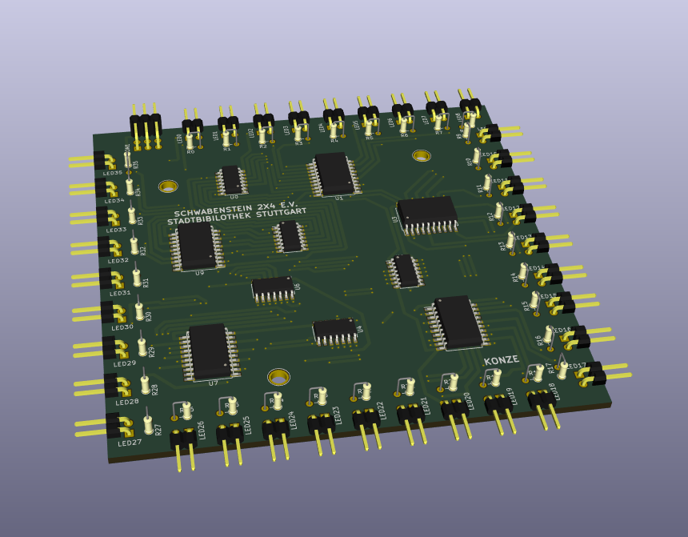

# Beleuchtung der LEGO Stadtbibliothek Stuttgart

## Platine
KiCad Projekt:
[beleuchtung_stadtbibliothek.pro](./kicad/beleuchtung_stadtbibliothek.pro)

Pin-Belegung `CON1`:

 * 1 => `VCC`
 * 2 => `GND`
 * 3 => `CLK`
 * 4 => Clear für für Schieberegister
 * 5 => Data-Input für Schieberegister 
 * 6 => Enable für LED-Treiber 

### Schaltplan
[beleuchtung_stadtbibliothek.sch](./kicad/beleuchtung_stadtbibliothek.sch)

### Layout/PCB
[beleuchtung_stadtbibliothek.kicad_pcb](./kicad/beleuchtung_stadtbibliothek.kicad_pcb)
    

### Gerber Dateien für Seeedstudio
TODO

## Steuerung
TODO
